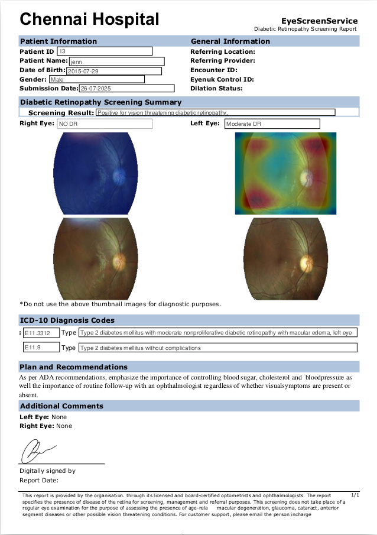

# MediReportAI – Artifact-Free Diabetic Retinopathy Report Generator

🧠 **AI in Healthcare & Diagnostics**

This project implements an **AI-powered pipeline for generating medical reports** from retinal fundus images and patient data.  
It focuses on **artifact-free diabetic retinopathy (DR) diagnosis** by combining U-Net–based artifact removal, DR severity classification, ICD coding, and automated PDF report generation.

---

## 🚀 Features
- **Artifact Removal**: U-Net image fusion to eliminate glare/flash artifacts from fundus images.  
- **DR Severity Classification**: Vision-Language Models (VLM) for reliable disease detection.  
- **Macular Edema Detection**: Additional retinal pathology screening.  
- **Explainability**: Grad-CAM visualizations for model transparency.  
- **ICD Code Prediction**: Automated mapping of diagnoses to ICD-10 codes.  
- **Report Generation**: End-to-end system that outputs standardized PDF medical reports.  
- **Database Support**: Patient data stored and retrieved via SQLite.  
- **Deployment Ready**: Dockerized setup for easy reproducibility.  
- **Interactive UI**: Built using **Streamlit** for a simple, web-based workflow.

---

## 🗂️ Project Structure
```
.
├── app.py              # Streamlit web app
├── backup.py           
├── db.py               # SQLite database handling
├── data/               
├── hospital.db         
├── models/             # Folder for trained AI models (download weights here)
├── outputs/            # Generated reports and results
├── sample_input/       # Example patient data and fundus images
├── template/           # Report templates (PDF/HTML)
├── utils/              # Helper functions
├── Demo.mp4            # Demo video of the system
├── Presentation.pdf    # Technical overview & slides
├── requirements.txt   
└── README.md          
```

---

## ⚙️ Installation
1. Clone the repo:
   ```bash
   git clone https://github.com/Shubham2376G/MedAI-ReportBuilder.git
   cd MedAI-ReportBuilder
   ```

2. Install dependencies:
   ```bash
   pip install -r requirements.txt
   ```

3. Download pretrained model weights and place them in the `models/` directory:

   https://drive.google.com/drive/folders/1d8DAmY1zOfN4QyncD6phN_z3QUeIxXX3?usp=sharing


---

## 🖥️ Usage
Run the **Streamlit app**:
```bash
streamlit run app.py
```

- Input: Patient demographics + retinal fundus images.  
- Output: PDF report with DR severity, Grad-CAM heatmaps, and ICD-10 codes.  

Sample input is available in `sample_input/`, and generated reports will be stored in `outputs/`.

---

## 📊 Demo & Sample Output
🎥 Check out the [Demo Video](./Demo.mp4).  
📑 See the [Presentation](./Presentation.pdf) for the technical overview.  

### Sample Report (Preview)


---

## 🧩 Tech Stack
- **Python** (Streamlit frontend, PyTorch for AI models)  
- **SQLite** for database integration  
- **U-Net with Residual Blocks** for artifact removal  
- **Grad-CAM** for explainability  

---

## 📌 Future Scope
- Extend to other retinal diseases (e.g., glaucoma, AMD).  
- Cloud-based deployment for large-scale screenings.  
- Integration with hospital EHR systems.  

---

## 📜 License
This project is licensed under the [MIT License](./LICENSE).  

---
